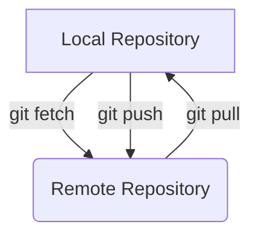
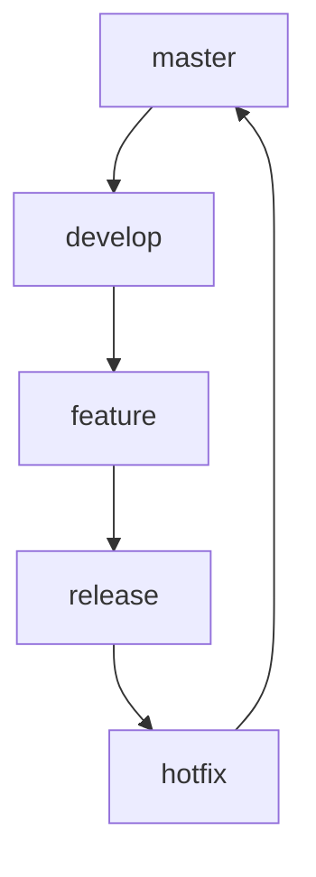
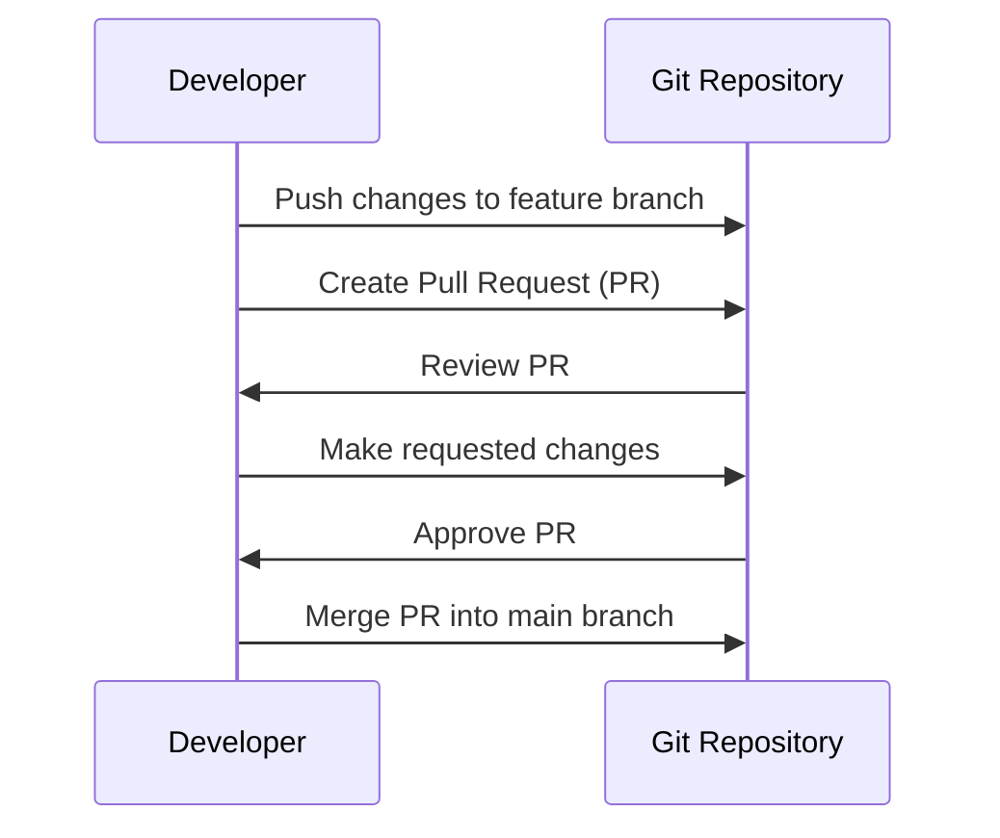

# Git Workflow 피드백
- Git의 일반적인 업무 흐름도

<br><br>
 - Git의 일반적인 Branching Strategy

<br><br>
 - Git의 일반적인 Pull Request

<br><br><br><br>
# Git 기본 사용법 Feedback
1. Git의 Staging Area<br>
Git의 Staging Area는 변경 사항을 커밋하기 전에 임시로 저장하는 공간입니다. 이를 통해 원하는 변경 사항만 선택적으로 커밋할 수 있습니다.
```bash
git add <file>
```
<br>

2. Git Branch<br>
Git Branch는 독립적인 작업을 위한 포인터입니다. 새로운 기능 개발이나 버그 수정 등을 위해 새로운 브랜치를 생성하고 작업할 수 있습니다.
```bash
git branch <branch-name>
```
<br>

3. Git Merge<br>
Git Merge는 두 개의 브랜치를 합치는 명령어입니다. 작업이 완료된 브랜치를 메인 브랜치와 합칠 때 사용합니다.
```bash
git merge <branch-name>
```
<br>

4. Git Rebase<br>
Git Rebase는 한 브랜치의 변경 사항을 다른 브랜치에 적용하는 명령어입니다. 이를 통해 커밋 히스토리를 깔끔하게 유지할 수 있습니다.
```bash
git rebase <branch-name>
```
<br>

5. Git Cherry-pick<br>
Git Cherry-pick은 특정 커밋을 현재 브랜치로 가져오는 명령어입니다. 이를 통해 원하는 커밋만 선택적으로 적용할 수 있습니다.
```bash
git cherry-pick <commit-hash>
```
<br>

6. Git Stash<br>
Git Stash는 작업 중인 변경 사항을 임시로 저장하고 원래의 상태로 되돌리는 명령어입니다. 다른 작업을 위해 잠시 변경 사항을 숨길 때 사용합니다.
```bash
git stash
```
<br>

7. Git Tag<br>
Git Tag는 특정 시점의 커밋에 대한 참조입니다. 주로 릴리즈 버전을 표시할 때 사용합니다.
```bash
git tag <tag-name>
```
<br>

8. Git Fetch<br>
Git Fetch는 원격 저장소의 최신 정보를 로컬에 가져오는 명령어입니다. 이를 통해 원격 저장소의 변경 사항을 확인할 수 있습니다.
```bash
git fetch
```
<br>

9. Git Pull<br>
Git Pull은 원격 저장소의 변경 사항을 로컬에 적용하는 명령어입니다. 이는 `git fetch`와 `git merge`를 동시에 수행합니다.
```bash
git pull
```
<br>

10. Git Push<br>
Git Push는 로컬의 변경 사항을 원격 저장소에 업로드하는 명령어입니다. 이를 통해 다른 사람들과 작업 내용을 공유할 수 있습니다.
```bash
git push
```