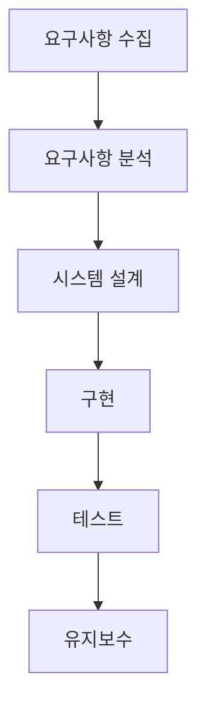

# 프로젝트 개발 방법론 Workflow 피드백
 - Waterfall 개발 방식의 일반적인 흐름도

  
 - 일반적인 개발에 필요한 문서들
   - 요구사항 명세서
   - 시스템 설계서
   - API 인터페이스 정의서
   - 전문 흐름도
   - 화면 설계서
   - 테스트 케이스
    

# 개발 문서를 읽을 때에는...
1. **요구사항 명세서**: 요구사항 명세서는 프로젝트의 목표와 기능을 정의합니다. 이를 통해 개발해야 할 기능과 그 기능이 어떻게 동작해야 하는지 이해하게 됩니다. 요구사항을 분석하고 이해하는 것이 중요하며, 모호한 부분은 클라이언트나 이해관계자와 논의하여 명확히 해야 합니다.

2. **시스템 설계서**: 시스템 설계서는 시스템의 아키텍처와 주요 컴포넌트를 설명합니다. 이 문서를 통해 시스템의 전체적인 구조와 각 컴포넌트가 어떻게 상호작용하는지 이해할 수 있습니다. 설계서를 바탕으로 개발 계획을 세우고 작업을 분배하는 것이 좋습니다.

3. **API 인터페이스 정의서**: API 인터페이스 정의서는 시스템 간의 통신 방법을 정의합니다. 이 문서를 통해 어떤 API가 제공되고, 각 API가 어떤 데이터를 요구하며, 어떤 응답을 반환하는지 알 수 있습니다. API를 사용할 때는 이 문서를 참조하여 올바르게 요청을 구성하고 응답을 처리해야 합니다.

4. **전문 흐름도**: 전문 흐름도는 시스템 간의 데이터 교환 과정을 시각화한 것입니다. 이를 통해 데이터가 어떻게 흐르는지, 어떤 단계를 거치는지 이해할 수 있습니다. 전문 흐름도를 바탕으로 시스템 간의 상호작용을 테스트하고 디버깅하는 것이 좋습니다.

5. **화면 설계서**: 화면 설계서는 사용자 인터페이스(UI)의 레이아웃과 동작을 설명합니다. 이 문서를 통해 사용자가 어떤 화면을 보게 될지, 그리고 사용자의 입력에 어떻게 반응할지 알 수 있습니다. 화면 설계서에 따라 UI를 구현하고, 사용자 경험(UX)을 최적화하는 것이 중요합니다.

6. **테스트 케이스**: 테스트 케이스는 시스템이 올바르게 동작하는지 검증하기 위한 시나리오입니다. 각 테스트 케이스는 특정 입력에 대한 예상 출력을 제공합니다. 개발 과정에서는 이러한 테스트 케이스를 바탕으로 단위 테스트와 통합 테스트를 수행하여 버그를 찾아내고 수정하는 것이 중요합니다.
    
# 기본적인 개발방법론 개념 피드백
1. Waterfall Model 
Waterfall Model은 프로젝트를 순차적인 단계로 나누어 진행하는 방법론입니다. 각 단계가 끝나야 다음 단계가 시작됩니다.
 

2. Agile Model 
Agile Model은 프로젝트를 작은 단위로 나누어 반복적으로 개발하는 방법론입니다. 고객의 피드백을 빠르게 반영할 수 있습니다.
 

3. Scrum 
Scrum은 Agile Model의 한 형태로, 고정된 기간(스프린트) 동안 작업을 진행하는 방법론입니다. 일일 스크럼 미팅을 통해 진행 상황을 점검합니다.
 

4. Kanban 
Kanban은 작업 상태를 시각화하여 프로젝트의 진행 상황을 한눈에 파악할 수 있는 방법론입니다. 작업 흐름의 병목 현상을 찾아 개선할 수 있습니다.
 

5. Lean 
Lean은 낭비를 최소화하고 가치를 극대화하는 것을 목표로 하는 방법론입니다. 고객 가치에 집중하며 지속적인 개선을 추구합니다.
 

6. DevOps 
DevOps는 개발(Dev)과 운영(Ops)의 경계를 허물고 협력을 강조하는 방법론입니다. CI/CD(지속적 통합/지속적 배포) 등을 통해 빠른 제품 출시와 유지보수를 가능하게 합니다.
 

7. Pair Programming 
Pair Programming은 두 명의 개발자가 한 컴퓨터에서 코드를 작성하는 방법론입니다. 코드 품질을 향상시키고 지식 공유를 촉진합니다.
 

8. Test-Driven Development (TDD) 
TDD는 테스트를 먼저 작성하고 그 테스트를 통과하는 코드를 작성하는 방법론입니다. 코드의 신뢰성을 높이고 리팩토링을 용이하게 합니다.
 

9. Behavior-Driven Development (BDD) 
BDD는 시스템의 동작을 명세화하고 검증하는 방법론입니다. 비즈니스 요구사항에 초점을 맞추며, 테스트 케이스를 통해 시스템 동작을 명확히 이해할 수 있습니다.
 

10. Code Review 
Code Review는 다른 개발자가 작성한 코드를 검토하는 방법론입니다. 코드 품질을 향상시키고 버그를 사전에 찾아낼 수 있습니다.