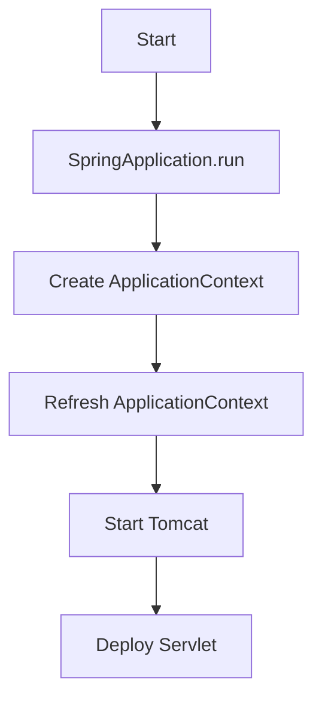
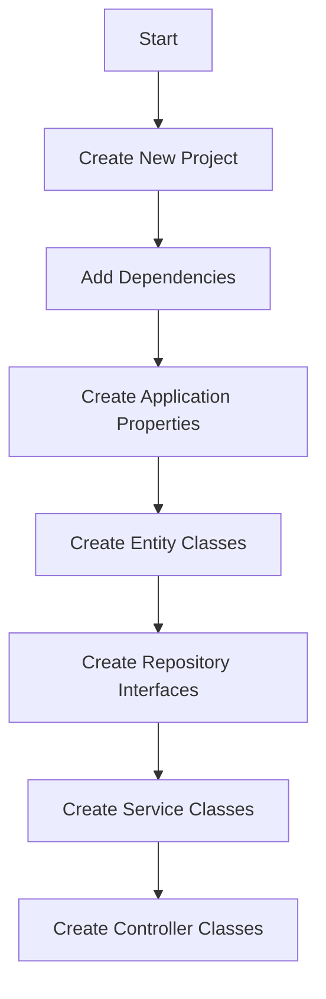

# Spring Boot Workflow 피드백
 - Spring Boot의 일반적인 부팅 흐름도

<br><br>
 - Spring Boot의 일반적인 개발 흐름도

<br><br><br>
# Spring Boot 기본 사용법 Feedback
1. Spring Boot AutoConfiguration<br>
Spring Boot의 AutoConfiguration은 개발자가 직접 빈을 설정하지 않아도 자동으로 필요한 빈을 설정해주는 기능입니다. 이를 통해 개발자는 비즈니스 로직에 집중할 수 있습니다.
```java
@SpringBootApplication
public class Application {
    public static void main(String[] args) {
        SpringApplication.run(Application.class, args);
    }
}
```
<br>

2. Spring Boot Starter<br>
Spring Boot Starter는 특정 기능을 사용하기 위해 필요한 의존성을 모아놓은 것입니다. 이를 통해 개발자는 필요한 의존성을 쉽게 추가할 수 있습니다.
```xml
<dependency>
  <groupId>org.springframework.boot</groupId>
  <artifactId>spring-boot-starter-web</artifactId>
</dependency>
```
<br>

3. Spring Boot Actuator<br>
Spring Boot Actuator는 애플리케이션의 상태를 모니터링하고 관리하는 기능을 제공합니다. 이를 통해 개발자는 애플리케이션의 상태를 쉽게 확인할 수 있습니다.
```xml
<dependency>
  <groupId>org.springframework.boot</groupId>
  <artifactId>spring-boot-starter-actuator</artifactId>
</dependency>
```
<br>

4. Spring Boot Profiles<br>
Spring Boot Profiles는 환경에 따라 다른 설정을 적용하기 위한 기능입니다. 이를 통해 개발, 테스트, 운영 등 다양한 환경에서 다른 설정을 적용할 수 있습니다.
```yaml
spring:
  profiles:
    active: dev
```
<br>

5. Spring Boot Logging<br>
Spring Boot Logging은 로깅 설정을 쉽게 할 수 있게 해줍니다. 이를 통해 개발자는 로그를 쉽게 관리할 수 있습니다.
```yaml
logging:
  level:
    root: INFO
    org.springframework.web: DEBUG
```
<br>

6. Spring Boot Data JPA<br>
Spring Boot Data JPA는 JPA를 쉽게 사용할 수 있게 해주는 기능입니다. 이를 통해 개발자는 데이터베이스 작업을 쉽게 할 수 있습니다.
```java
@Repository
public interface UserRepository extends JpaRepository<User, Long> {
}
```
<br>

7. Spring Boot Security<br>
Spring Boot Security는 애플리케이션의 보안을 쉽게 관리할 수 있게 해주는 기능입니다. 이를 통해 개발자는 인증과 인가를 쉽게 처리할 수 있습니다.
```java
@Configuration
@EnableWebSecurity
public class SecurityConfig extends WebSecurityConfigurerAdapter {
}
```
<br>

8. Spring Boot Test<br>
Spring Boot Test는 애플리케이션의 테스트를 쉽게 작성하고 실행할 수 있게 해주는 기능입니다. 이를 통해 개발자는 단위 테스트와 통합 테스트를 쉽게 작성할 수 있습니다.
```java
@SpringBootTest
class ApplicationTests {
    @Test
    void contextLoads() {
    }
}
```
<br>

9. Spring Boot DevTools<br>
Spring Boot DevTools는 개발 시간을 단축시켜주는 여러 가지 편의 기능을 제공합니다. 이를 통해 개발자는 더 효율적으로 개발할 수 있습니다.
```xml
<dependency>
  <groupId>org.springframework.boot</groupId>
  <artifactId>spring-boot-devtools</artifactId>
  <optional>true</optional>
</dependency>
```
<br>

10. Spring Boot Admin<br>
Spring Boot Admin은 Spring Boot 애플리케이션을 원격으로 관리할 수 있는 기능을 제공합니다. 이를 통해 개발자는 애플리케이션의 상태를 원격에서도 쉽게 확인할 수 있습니다.
```xml
<dependency>
  <groupId>de.codecentric</groupId>
  <artifactId>spring-boot-admin-starter-server</artifactId>
  <version>2.3.1</version>
</dependency>
```