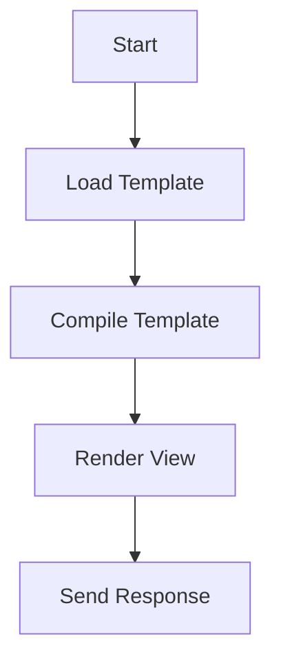
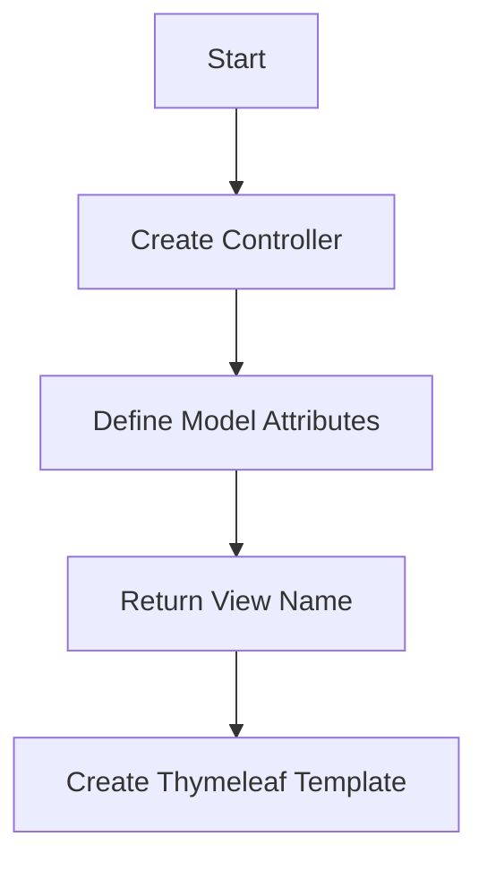

# Thymeleaf Workflow 피드백
 - Thymeleaf 템플릿 컴파일 흐름도

<br><br>
 - Thymeleaf의 일반적인 개발 흐름도

<br><br><br><br>
# Thymeleaf 기본 사용법 피드백
1. Thymeleaf Template Engine<br>
Thymeleaf는 서버 사이드 Java 템플릿 엔진입니다. HTML, XML, JavaScript, CSS 등의 웹 리소스를 동적으로 생성할 수 있습니다.
```java
@Controller
public class HomeController {
    @GetMapping("/")
    public String home(Model model) {
        model.addAttribute("message", "Hello, Thymeleaf!");
        return "home";
    }
}
```
<br>

2. Thymeleaf Expression<br>
Thymeleaf는 다양한 표현식을 지원합니다. 변수 표현식(`${...}`), 선택 변수 표현식(`*{...}`), 메시지 표현식(`#{...}`) 등을 사용할 수 있습니다.
```html
<p th:text="${message}"></p>
```
<br>

3. Thymeleaf Standard Dialects<br>
Thymeleaf는 표준 방언을 제공합니다. 이를 통해 HTML 태그에 `th:` 접두사를 붙여 동적인 웹 페이지를 생성할 수 있습니다.
```html
<p th:text="${message}"></p>
```
<br>

4. Thymeleaf Layout Dialect<br>
Thymeleaf Layout Dialect는 페이지 레이아웃을 재사용하기 위한 방언입니다. 이를 통해 중복 코드를 줄이고 유지 관리를 용이하게 할 수 있습니다.
```html
<div layout:fragment="content">
  <!-- Page content -->
</div>
```
<br>

5. Thymeleaf Spring Integration<br>
Thymeleaf는 Spring Framework와 잘 통합됩니다. Spring MVC와 함께 사용하여 웹 애플리케이션을 구축할 수 있습니다.
```java
@Controller
public class HomeController {
    @GetMapping("/")
    public String home(Model model) {
        model.addAttribute("message", "Hello, Thymeleaf!");
        return "home";
    }
}
```
<br>

6. Thymeleaf Form Handling<br>
Thymeleaf는 폼 처리를 지원합니다. `th:object`와 `th:field` 속성을 사용하여 폼 데이터를 모델 객체에 바인딩할 수 있습니다.
```html
<form th:object="${user}" th:action="@{/submit}" method="post">
  <input type="text" th:field="*{username}">
  <input type="password" th:field="*{password}">
  <input type="submit" value="Submit">
</form>
```
<br>

7. Thymeleaf Validation<br>
Thymeleaf는 Bean Validation을 지원합니다. `th:errors` 속성을 사용하여 유효성 검사 오류 메시지를 표시할 수 있습니다.
```html
<input type="text" th:field="*{username}">
<span th:if="${#fields.hasErrors('username')}" th:errors="*{username}"></span>
```
<br>

8. Thymeleaf Internationalization<br>
Thymeleaf는 국제화(i18n)를 지원합니다. `#{...}` 메시지 표현식과 함께 `messages.properties` 파일을 사용하여 다국어 웹 사이트를 구축할 수 있습니다.
```html
<p th:text="#{welcome.message}"></p>
```
<br>

9. Thymeleaf Fragments<br>
Thymeleaf는 프래그먼트를 지원합니다. `th:fragment`와 `th:replace` 또는 `th:include` 속성을 사용하여 코드 조각을 재사용할 수 있습니다.
```html
<div th:fragment="header">
  <!-- Header content -->
</div>
<div th:replace="~{::header}">
  <!-- Replaced with header content -->
</div>
```
<br>

10. Thymeleaf with Spring Security<br>
Thymeleaf는 Spring Security와 통합하여 보안 기능을 제공합니다. `sec:` 접두사를 사용하여 인증된 사용자의 정보를 표시하거나 특정 내용을 인증된 사용자에게만 표시할 수 있습니다.
```html
<p sec:authentication="name"></p>
<div sec:authorize="hasRole('ROLE_ADMIN')">
  <!-- Admin content -->
</div>
```